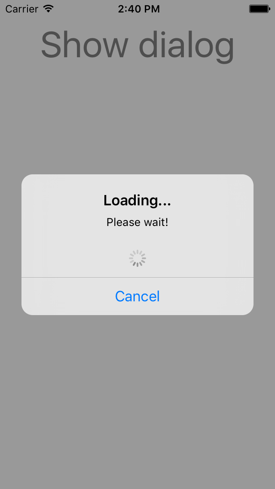
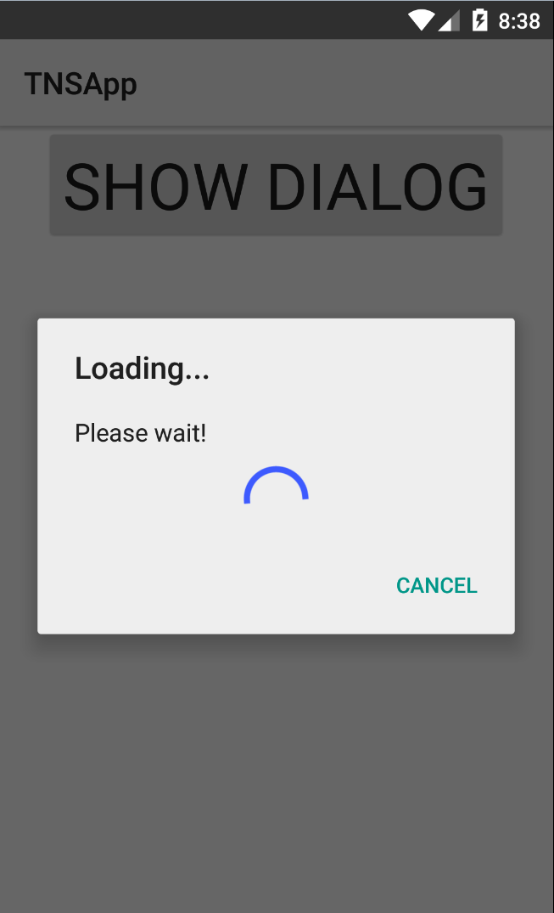

# NativeScript Dialog

A NativeScript plugin for iOS and Android that allows you to create custom dialog.
Do to the fact the original NativeScript-Dialog has a major bug on iOS, and is no longer maintained, we are now maintaining this version here.

## Installation
`tns plugin add @nstudio/nativescript-dialog`

## Usage

###
```XML
<Page>
   <StackLayout>
     <Button text="Show dialog" tap="buttonTap" />
   </StackLayout>
</Page>
```

```JavaScript
const platform = require("tns-core-modules/platform");
const dialog = require("@nstudio/nativescript-dialog");

exports.buttonTap = function() {
  let nativeView;

  if(platform.device.os === platform.platformNames.ios) {
      nativeView = UIActivityIndicatorView.alloc().initWithActivityIndicatorStyle(UIActivityIndicatorViewStyle.UIActivityIndicatorViewStyleGray);
      nativeView.startAnimating();
  } else if(platform.device.os === platform.platformNames.android) {
      nativeView = new android.widget.ProgressBar(dialog.getContext());
      nativeView.setIndeterminate(true);
  }

  dialog.show({
	title: "Loading...",
	message: "Please wait!",
	cancelButtonText: "Cancel",
	nativeView: nativeView}
  )
  .then( (r) => { console.log("Result: " + r); })
  .catch( (e) => { console.log("Error: " + e) });
}
```
iOS | Android
------------ | -------------
 | 


## Functions
### show( { options } ) 
- Shows the dialog 
##### Options:
* **title**: String title of the dialog;
* **message**: String message in the dialog;
* **nativeView**: a Native view that you want to embed in the dialog;
* **cancelButtonText**: Text on the Cancel button;
* **neutralButtonText**: Text on the Neutral button
* **okButtonText**: Text on the OK button;
* **CancelAllowed**: true/false, allow cancelling; 

### close() 
- Closes the dialog

### getContext() 
- Android only, gets the current context for any UI things that need a context.